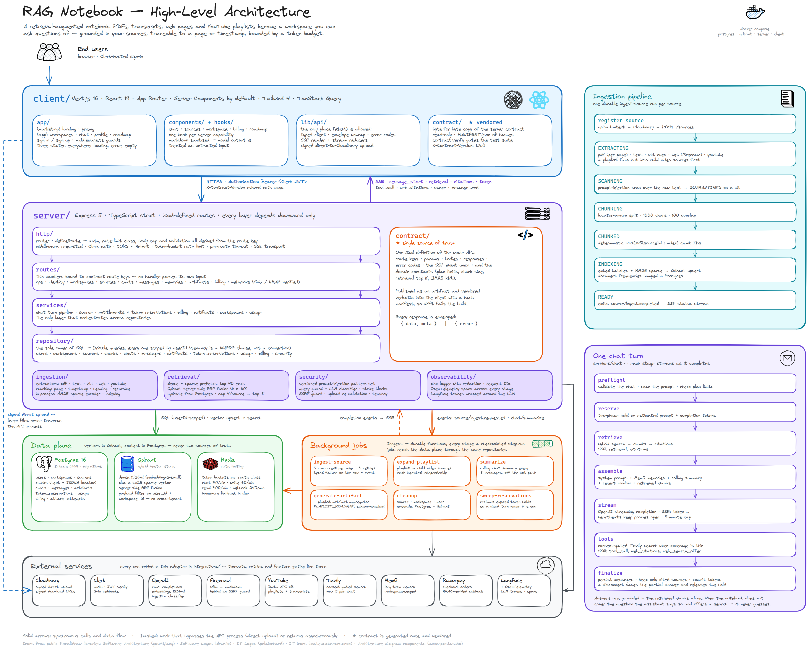

<div align="center">

# 📓 RAG Notebook

**Turn PDFs, transcripts, web pages and YouTube playlists into a workspace you can ask questions of — with citations that point back to the exact page or timestamp.**

<p>
  
  
  
  
  
  
  
</p>

</div>

---

## Table of contents

| Section | What's in it |
| --- | --- |
| [What it is](#what-it-is) | The product in one screen |
| [Feature tour](#feature-tour) | Everything the app does |
| [Architecture](#architecture) | System diagram and the two halves |
| [The contract](#the-contract-single-source-of-truth) | How client and server stay in sync |
| [Ingestion pipeline](#ingestion-pipeline) | File → chunks → vectors |
| [Retrieval and the chat turn](#retrieval-and-the-chat-turn) | Hybrid search → grounded answer |
| [Podcast](#podcast-workspace-audio-overview) | Sources → two-host audio overview |
| [Data model](#data-model) | Tables and what owns what |
| [Security model](#security-model) | Tenancy, prompt injection, guards |
| [Entitlements and billing](#entitlements-and-billing) | Plans, tokens, reservations |
| [Getting started](#getting-started) | Run it locally |
| [Configuration](#configuration) | Environment variables |
| [Commands](#commands) | Scripts you'll actually use |
| [Testing](#testing) | What's covered |
| [Repository layout](#repository-layout) | Where things live |

---

## What it is

RAG Notebook is a **retrieval-augmented notebook**. You create a *workspace*, add *sources* to it, and then chat with those sources. Answers are streamed token by token and every claim carries a citation that resolves to a real location — a PDF page, a transcript timestamp, a heading in a scraped article.

Three properties define the system:

- **Grounded.** The model answers from retrieved chunks of *your* sources, not from its own memory. When coverage is thin it says so and offers a web search instead of guessing.
- **Traceable.** Every chunk keeps a *locator*. Citations are deep links, not footnote decoration.
- **Bounded.** Every plan has limits, every token is reserved before it is spent, and every source belongs to exactly one user and one workspace — enforced at the query level, not by convention.

---

## Feature tour

### Sources

| Type | How it is ingested |
| --- | --- |
| `PDF` | Uploaded to Cloudinary, text extracted per page with `unpdf`, chunked page-aware |
| `TEXT` | `.txt` / `.md` upload, chunked by recursive character split |
| `VTT` | Subtitle files parsed into cues, chunked into ~45s topic windows |
| `WEB_URL` | Scraped with Firecrawl to markdown, chunked by heading |
| `YOUTUBE_VIDEO` | Transcript pulled and chunked on timestamps |
| `YOUTUBE_PLAYLIST` | Expanded via the YouTube Data API into child video sources, each ingested independently |

Uploads use a **signed direct-to-Cloudinary intent**: the client asks the API for a signature, uploads the bytes straight to Cloudinary, then registers the source. Large files never traverse the API process.

Sources report live status over SSE (`uploading → processing → indexed / failed`), can be retried after a failure, previewed in place, and downloaded through a signed URL.

### Chat

- **Streaming answers** over Server-Sent Events with a typed event union — `message_start`, `retrieval`, `citations`, `tool_call`, `web_citations`, `web_search_offer`, `token`, `usage`, `message_end`, `error`, `heartbeat`.
- **Inline citations** rendered as markers; clicking one opens the cited chunk with its locator.
- **Consent-gated web search.** When the notebook doesn't cover the question, the assistant *offers* a Tavily search rather than silently reaching outside your sources. You answer "yes" — capped at 5 searches per chat.
- **Rolling summarisation.** Every 8 messages a background job summarises the conversation so long chats stay inside the context budget without losing history.
- **Long-term memory** via Mem0 — facts extracted from past turns are retrieved alongside chunks.
- **Reactions** (like / dislike with a reason) on assistant messages.
- **Speech in and out** — browser speech-to-text on the composer, text-to-speech on answers.

### Artifacts

A generated, structured document derived from a source. Today: **`PLAYLIST_ROADMAP`** — feed it a YouTube playlist and it returns a validated learning roadmap (overview, difficulty, ordered modules with objectives, prerequisites, key concepts and time estimates), rendered as an interactive roadmap page with per-module progress.

### Account

Clerk-hosted sign-in, display-name editing, a usage chart over time, a token budget summary, coupon redemption, and Razorpay checkout for the Pro tier.

---

## Design


## Architecture

```
┌──────────────────────────────────────────────────────────────────────────┐
│  client/  —  Next.js 16 · React 19 · App Router · Tailwind 4             │
│                                                                          │
│   app/(marketing)   app/(app)         lib/api/          contract/       │
│   landing, pricing  workspaces,       typed client,     VENDORED,        │
│                     profile, roadmap  SSE, upload       read-only        │
└────────────────────────────────┬─────────────────────────────────────────┘
                                 │  HTTPS · Bearer (Clerk) · X-Contract-Version
                                 ▼
┌──────────────────────────────────────────────────────────────────────────┐
│  server/  —  Express 5 · TypeScript · Zod-defined routes                 │
│                                                                          │
│   http/          routes/        services/       ingestion/   retrieval/ │
│   middleware,    thin           business        extract,     hybrid,     │
│   router,        handlers       logic           chunk, embed  fuse, cite │
│   SSE transport                                                          │
│                        repository/  ← the only layer that touches SQL    │
└───┬──────────────┬──────────────┬──────────────┬─────────────┬───────────┘
    │              │              │              │             │
    ▼              ▼              ▼              ▼             ▼
┌────────┐   ┌──────────┐   ┌──────────┐   ┌──────────┐  ┌───────────┐
│Postgres│   │  Qdrant  │   │ Inngest  │   │  OpenAI  │  │ Cloudinary│
│Drizzle │   │dense+BM25│   │  jobs    │   │chat+embed│  │  storage  │
└────────┘   └──────────┘   └──────────┘   └──────────┘  └───────────┘
       Clerk (auth) · Razorpay (billing) · Tavily (web) · Firecrawl (scrape)
       Mem0 (memory) · Langfuse + OpenTelemetry (tracing)
```

### Layering rules

The server is strictly layered and the direction of dependency never inverts:

```
route  →  service  →  repository  →  Drizzle/Postgres
   ↘        ↘
  contract  integrations (OpenAI, Qdrant, Cloudinary, …)
```

- **Routes** are declarative. `defineRoute` binds a contract definition to a handler; the router derives auth, rate-limit class, body-size cap and validation from the route key. No handler parses its own input.
- **Services** hold the business logic and are the only place that orchestrates across repositories.
- **Repositories** are the sole owners of SQL. Every query is scoped by `userId` — tenancy is a `WHERE` clause, not a hope.
- **Config** is read once. `src/config/env.ts` validates the whole environment with Zod at boot and refuses to start on a bad value; nothing else reads `process.env`.

### Client rules

- Server Components by default; `"use client"` pushed as far down the tree as possible.
- **No `fetch()` outside `src/lib/api/`.** Everything goes through the typed client so auth headers, contract-version headers, envelope unwrapping and error typing happen in exactly one place.
- Server state lives in TanStack Query; context is reserved for loader, toast and current user. No global store.
- Every async surface renders three states: loading, error, empty.
- Model output is treated as untrusted — markdown is sanitised, raw HTML rejected.

---

## The contract: single source of truth

`server/src/contract/` defines the API once, in Zod: route keys, params, bodies, responses, error codes, SSE event shapes, and the domain constants (plan limits, chunking parameters, retrieval top-K, BM25 coefficients).

That directory is published as an artifact and **vendored verbatim** into `client/src/contract/` alongside a `MANIFEST.json` of hashes. The client treats it as read-only; `pnpm contract:verify` fails the build if a byte changed. Types for the client's fetch layer are generated from the same source (`openapi.json` → `types.d.ts`).

Both sides send and echo `X-Contract-Version` (currently **1.3.0**). A major mismatch is surfaced as a console warning rather than a hard failure — a client that refuses to run on a minor bump is worse than one that logs.

**Every response is enveloped:**

```jsonc
// success
{ "data": { … }, "meta": { "nextCursor": "…", "hasMore": true } }

// failure
{ "error": { "code": "PLAN_LIMIT_EXCEEDED", "message": "…", "details": { … } } }
```

Error codes are a closed set: `VALIDATION_ERROR`, `UNAUTHENTICATED`, `FORBIDDEN`, `NOT_FOUND`, `CONFLICT`, `PAYLOAD_TOO_LARGE`, `UNSUPPORTED_MEDIA_TYPE`, `RATE_LIMITED`, `PLAN_LIMIT_EXCEEDED`, `TOKEN_QUOTA_EXCEEDED`, `PROMPT_TOO_LONG`, `SOURCE_NOT_READY`, `SECURITY_VIOLATION`, `USER_BLOCKED`, `UPSTREAM_ERROR`, `INTERNAL_ERROR`.

<details>
<summary><b>API surface</b> — all routes are under <code>/api/v1</code></summary>

| Area | Routes |
| --- | --- |
| **Ops** | `GET /healthz` · `GET /readyz` · `GET /_contract` · `GET /me/usage` |
| **Identity** | `GET /me` · `PATCH /me` · `POST /webhooks/clerk` |
| **Workspaces** | `GET /workspaces` · `POST /workspaces` · `GET|PATCH|DELETE /workspaces/:workspaceId` |
| **Sources** | `POST /workspaces/:workspaceId/sources/upload-intent` · `POST|GET /workspaces/:workspaceId/sources` · `GET /workspaces/:workspaceId/sources/events` *(SSE)* · `GET|DELETE /sources/:sourceId` · `GET /sources/:sourceId/status` · `POST /sources/:sourceId/retry` · `GET /sources/:sourceId/download` · `GET /sources/:sourceId/preview` |
| **Chats** | `GET|POST /workspaces/:workspaceId/chats` · `GET|PATCH|DELETE /chats/:chatId` · `GET /chats/:chatId/messages` · `POST /chats/:chatId/messages` *(SSE)* |
| **Messages** | `POST /messages/:messageId/reaction` |
| **Memories** | `GET|POST /memories` · `PATCH|DELETE /memories/:memoryId` |
| **Artifacts** | `GET|POST /sources/:sourceId/artifacts` · `GET /artifacts/:artifactId` |
| **Billing** | `GET /plans` · `POST /coupons/redeem` · `POST /billing/checkout` · `POST /webhooks/razorpay` |

</details>

---

## Ingestion pipeline

Ingestion runs as an **Inngest** durable function (`ingest-source`), five concurrent jobs per user, three retries, with a failure handler that records a typed failure on the row and emits `source/ingest.failed`. Each stage is a checkpointed `step.run`, so a retry resumes rather than restarts.

```
   register source
        │
        ▼
   ┌─────────┐   playlist?   ┌──────────────────┐
   │EXTRACTING├──────────────►│ expand → children │
   └────┬────┘               └──────────────────┘
        │  extract text + segments (each carries a locator)
        ▼
   ┌─────────┐  prompt-injection scan over raw text
   │SCANNING │──── dirty ───► QUARANTINED
   └────┬────┘
        │ clean
        ▼
   ┌─────────┐  locator-aware split · 1000 chars · 100 overlap
   │CHUNKING │
   └────┬────┘
        ▼
   ┌─────────┐  deterministic chunk IDs · UUIDv5(sourceId:index)
   │ CHUNKED │
   └────┬────┘
        ▼
   ┌─────────┐  embed batches (text-embedding-3-small, 1536-d)
   │INDEXING │  + BM25 sparse vector · upsert into Qdrant
   └────┬────┘  + document-frequency table bumped in Postgres
        ▼
     ┌─────┐
     │READY│  ──► emits source/ingest.completed
     └─────┘
```

Notable details:

- **Locators are first class.** Every extracted segment knows where it came from — `pdf_page`, `timestamp`, `web`, `text_range` — and the chunker for that kind preserves it. This is what makes a citation clickable.
- **Chunk IDs are deterministic.** `chunkId(sourceId, index)` is a UUIDv5 over a fixed namespace, so re-indexing overwrites points instead of duplicating them; a stale tail is deleted explicitly.
- **Sparse vectors are computed in-process.** A hashed BM25 encoder (`k1=1.2`, `b=0.75`) produces the lexical side of the index. Document frequencies live in Postgres so query-time IDF is exact.
- **Embedding spends tokens**, so it reserves them first and commits or releases afterwards — a quota failure quarantines the job with `TOKEN_QUOTA_EXCEEDED` instead of half-indexing a source.

Other background functions: `expand-playlist`, `summarize` (chat summarisation), `generate-artifact` + `playlist-artifact-aggregator`, `cleanup` (source / workspace / user cascade), and `sweep-reservations` (reclaims expired token holds).

---

## Retrieval and the chat turn

### Hybrid retrieval

```
        query
          │
    ┌─────┴──────┐
    ▼            ▼
dense embed   BM25 sparse encode
(top 40)      (top 40, IDF from Postgres)
    └─────┬──────┘
          ▼
  Qdrant server-side RRF fusion  (k = 60)
          ▼
  hydrate from Postgres · re-attach content + locators
          ▼
  cap 4 chunks per source → final top 8
```

Both prefetches carry the same `user_id` + `workspace_id` payload filter, so cross-tenant leakage is impossible at the vector store, not just at the API. The per-source cap keeps one verbose document from crowding out the rest of the notebook.

### One chat turn

```
preflight        validate chat, scan the prompt for injection, check plan limits
    ↓
reserve          hold estimated prompt + completion tokens against the budget
    ↓
retrieve         hybrid search → chunks → citations   [SSE: retrieval, citations]
    ↓
assemble         system prompt + memories + rolling summary + recent window + chunks
    ↓
stream           OpenAI streaming completion          [SSE: token …]
    ↓
tools            optional consent-gated web search    [SSE: tool_call, web_citations]
    ↓
finalize         persist messages, keep only cited sources, commit tokens
                                                      [SSE: usage, message_end]
```

The stream is defensive by construction: heartbeats keep proxies from closing it, a 5-minute cap aborts a runaway turn, and a client disconnect persists the partial answer with `finishReason: "aborted"` and releases the reservation. A turn that dies never silently bills you.

## Podcast: workspace audio overview

A **podcast** is one ~5-minute, two-host audio overview per workspace (unique on `workspace_id`), generated on demand from every ready source — the Gemini/NotebookLM-style "listen to your notebook" feature. Regenerating supersedes the previous one. Like ingestion it runs as an **Inngest** durable function (`generate-podcast`), one job per user, each stage a checkpointed `step.run`.

```
   POST /workspaces/:id/podcast   (slot + ready-source gate → 202 PENDING)
        │
        ▼
   ┌──────────┐  READY sources only · playlists → ≤5 READY children
   │ ASSEMBLE │  · newest-first, capped at 15
   └────┬─────┘
        │  per source: reserve → summarise (~120 words) → commit tokens
        ▼
   ┌──────────┐  one LLM writes BOTH hosts (Maya / Ravi) as a turn list
   │ SCRIPTING│  · validated against PodcastScriptSchema · 1 corrective retry
   └────┬─────┘  · target ~800 words, hard ceiling 1400
        │
        ▼
   ┌──────────────┐  OpenAI gpt-4o-mini-tts · fixed voice per host
   │ SYNTHESIZING │  · one request per turn · bounded fan-out (8) · per-turn retry
   └──────┬───────┘
          │  MP3 fragments (24 kHz / 128 kbps CBR mono)
          ▼
   ┌──────────┐  in-process frame-concatenation + duration walk (no ffmpeg)
   │ CONCAT   │  → Cloudinary raw authenticated upload
   └────┬─────┘
        ▼
     ┌─────┐  audioUrl is a freshly-signed inline URL, minted per GET
     │READY│
     └─────┘
```

Notable details:

- **One LLM plays both hosts.** A single completion emits the whole script as a list of `{ speaker, text }` turns — `HOST_A`/`HOST_B` are *roles* (Maya asks and drives; Ravi explains and synthesises), mapped to display names and fixed TTS voices only at the edge, so renaming a host never touches the schema. The script is validated against a Zod `PodcastScriptSchema` (per-turn ≤600 chars so each turn is a single TTS request; total word count bounded) with exactly one corrective retry before the job fails.
- **No ffmpeg.** `gpt-4o-mini-tts` returns tag-free, constant-bitrate MP3 with the bit reservoir unused, so the fragments concatenate byte-wise into a valid stream. A pure frame-walker (`integrations/mp3.ts`) validates each fragment's MPEG frame header, strips any ID3, joins them, and measures duration by summing `samples / sampleRate` across frames. Validated against a real decoder (`afinfo`) to the decimal.
- **Two-phase token reservation**, same discipline as ingestion: each per-source summary reserves `COMPLETION` tokens up front and commits actual usage (or releases on failure), so a quota shortfall fails the job cleanly with a typed reason rather than half-generating.
- **Typed failures.** The `FAILED` status carries one of `no_usable_sources`, `script_generation_failed`, or `synthesis_failed`; `FAILED` is terminal and occupies no slot.
- **Staleness is display-only.** Adding or deleting a source marks the podcast `isStale` with reason `SOURCES_CHANGED` (via an event-driven `mark-podcast-stale` function on `source/ingest.completed` and source deletion). It never triggers regeneration — the user decides.
- **Cleanup can't leak a slot.** A workspace is soft-deleted, so the FK cascade never fires; the `cleanup` cascade therefore hard-deletes the podcast row and destroys its Cloudinary asset explicitly, at both workspace and user scope.

**Entitlement.** Podcasts use a *concurrent-slot* cap (a live count, not a lifetime budget): **FREE = 1, PRO = 10, CUSTOM = unlimited**, counted across all of a user's workspaces. Deleting a podcast frees its slot immediately.

**API.** `GET` (returns the podcast or `null`, minting a fresh signed `audioUrl` when READY), `POST` (202 with the PENDING podcast; enforces the slot cap and requires ≥1 ready source), `DELETE` (hard-delete + asset destroy). The wire shape is **audio only** — no script, no citations; the script lives server-side in a JSONB column for diagnostics.

**Client.** A `WorkspacePodcast` panel pinned to the top of the workspace page renders every lifecycle state — absent, producing (TanStack Query self-polls every 2.5s while PENDING/SCRIPTING/SYNTHESIZING), ready (native `<audio>` + duration), failed, and stale — with delete and regenerate behind a confirm dialog.

---

## Data model

Postgres via **Drizzle ORM**, migrations in `server/drizzle/`.

| Table | Purpose |
| --- | --- |
| `users` | Clerk-linked identity, plan tier, assigned and used token counters |
| `workspaces` | Top-level container; owns sources and chats |
| `sources` | One ingested document. Self-referencing `parent_source_id` models playlists → videos. Soft-deleted. |
| `chunks` | Chunk text, `embedding_text`, token count, JSONB `locator`, generated `locator_kind` column, doc length for BM25 |
| `chats` / `messages` | Conversations, rolling `summary`, per-message model, finish reason, citations, reactions |
| `artifacts` | Generated documents (roadmaps) with status, content, tokens consumed |
| `podcasts` | One per workspace; status, signed-audio metadata, duration, JSONB script, stale flag. Slot-capped per plan. |
| `token_reservations` | Two-phase token holds — `reserve → commit` or `release`, swept on expiry |
| `usage` | Daily token rollups powering the usage chart |
| `billing` | Subscriptions, orders, coupons, redemptions |
| `attack_attempts` | Recorded prompt-injection hits, redacted, with rule ID and pattern-set version |

Chunk *vectors* live in Qdrant; chunk *content* lives in Postgres. Retrieval fuses IDs in Qdrant and hydrates text from Postgres, so the vector store never becomes a second source of truth.

---

## Security model

**Tenancy.** Every repository function takes a `userId` and filters on it. Qdrant payload indexes on `user_id` / `workspace_id` mean the same holds for vector search. Cross-tenant events (an ingestion event whose workspace doesn't match the row) raise a non-retriable error. There is a dedicated `tenancy-audit` integration test.

**Prompt injection.** A versioned rule set (`PATTERN_SET_VERSION`) covers instruction override, role reassignment, system-prompt extraction, delimiter injection and encoded payloads. Text is normalised first — NFKC, lowercase, zero-width stripped, Cyrillic/Greek homoglyphs folded — so `іgnore previous` is caught alongside `ignore previous`. It runs in two places:

- on **ingested documents**, where a hit quarantines the source;
- on **user queries**, where a hit is recorded and, past a strike threshold, blocks the user (`USER_BLOCKED`).

Long or delimiter-shaped queries additionally go to an LLM classifier with a short-TTL cache. Excerpts stored for audit are redacted around the match.

**Transport and input.** Helmet, an explicit CORS origin allowlist, request IDs on every request and response, per-route timeouts, a 1 MB JSON cap plus per-route-class body caps, and token-bucket rate limiting backed by Redis (in-memory fallback in dev):

| Class | Budget | Scope |
| --- | --- | --- |
| `chat` | 30 / min | user + IP |
| `write` | 60 / min | user + IP |
| `read` | 300 / min | user + IP |
| `uploadIntent` | 20 / min | user + IP |
| `coupon` | 5 / 10 min | user + IP |
| `webhook` | 240 / min | IP |

**Uploads.** Signed upload intents are bound to the requesting user's public-ID prefix; MIME and extension must agree; the server re-validates content on ingest. Outbound URLs pass an SSRF guard that rejects private and link-local ranges.

**Webhooks.** Clerk webhooks are Svix-verified, Razorpay webhooks HMAC-verified, both against the raw request body captured before JSON parsing.

---

## Entitlements and billing

| | FREE | PRO | CUSTOM |
| --- | --- | --- | --- |
| Workspaces | 10 | 100 | contact |
| Sources / workspace | 7 | unlimited | contact |
| Lifetime tokens | 1,000,000 | unlimited | contact |
| Prompt words | 5,000 | unlimited | contact |
| Max file size | 10 MB | 100 MB | contact |
| Playlist videos | 20 | 200 | contact |

Tokens use **two-phase reservation**. Before any spend, an estimate is held against the budget inside a transaction that locks the user row; afterwards the actual usage is committed and the remainder released. Abandoned holds are swept on a schedule. `remaining = assigned − usedEmbedding − usedCompletion − reserved`, so concurrent turns can't jointly overspend a budget.

Upgrades run through Razorpay checkout; the webhook is the only thing that grants Pro. The client renders a *confirming your payment* state until `GET /me` itself reports `PRO` — a successful callback is not proof of anything. Coupons grant tokens atomically with per-code caps, expiry, and one redemption per user.

---

## Getting started

### Prerequisites

- Node ≥ 20.11 (the images use 22), **pnpm** ≥ 9
- Docker, for Postgres and Qdrant
- API keys: Clerk, OpenAI, Cloudinary. Optional but feature-gating: Firecrawl (web scrape), YouTube Data API (playlists), Tavily (web search), Mem0 (memory), Razorpay (billing), Langfuse (tracing).

### Option A — everything in Docker

```bash
cp server/.env.example server/.env && cp client/.env.example client/.env
docker compose up --build
```

Client on **http://localhost:3000**, API on **http://localhost:8080**, Postgres on 5432, Qdrant on 6333.

> `NEXT_PUBLIC_*` values are baked into the client bundle at build time. Change one and you must rebuild: `docker compose build client`.

### Option B — local dev with containerised infrastructure

```bash
# 1. infrastructure
cd server && pnpm services:up

# 2. server
pnpm install
cp .env.example .env          # fill in the keys
pnpm db:migrate
pnpm dev                      # http://localhost:3000 by default

# 3. background jobs (separate terminal, from server/)
pnpm dev:inngest              # Inngest dev server against /api/inngest

# 4. client (separate terminal)
cd ../client && pnpm install
cp .env.example .env.local    # point NEXT_PUBLIC_API_URL at the server
pnpm dev
```

> Set `PORT=8080` in `server/.env` if you want the defaults in `client/.env.example` (`http://localhost:8080/api/v1`) to line up without editing.

### First run

1. Sign up through Clerk — the API provisions your user row on first authenticated request, or via the Clerk webhook.
2. Create a workspace.
3. Add a source and watch the status stream carry it to **indexed**.
4. Open a chat and ask something. Citations appear under the answer as it streams.

---

## Configuration

All server variables are validated by Zod at boot; a missing or malformed value reports **every** problem at once and refuses to start.

<details>
<summary><b><code>server/.env</code></b></summary>

| Variable | Notes |
| --- | --- |
| `NODE_ENV`, `PORT`, `LOG_LEVEL`, `APP_URL` | Runtime |
| `CLIENT_ORIGINS` | Comma-separated CORS allowlist |
| `DATABASE_URL` | Postgres connection string |
| `CLERK_PUBLISHABLE_KEY`, `CLERK_SECRET_KEY`, `CLERK_WEBHOOK_SECRET` | Auth |
| `OPENAI_API_KEY`, `CHAT_MODEL`, `EMBEDDING_MODEL`, `CLASSIFIER_MODEL` | Models |
| `QDRANT_URL`, `QDRANT_API_KEY`, `QDRANT_COLLECTION` | Vector store |
| `CLOUDINARY_*` | File storage and signed URLs |
| `INNGEST_EVENT_KEY`, `INNGEST_SIGNING_KEY`, `INNGEST_DEV` | Jobs. Both keys required in production. |
| `LANGFUSE_*` | LLM tracing |
| `MEM0_API_KEY`, `TAVILY_API_KEY`, `FIRECRAWL_API_KEY`, `YOUTUBE_API_KEY` | Integrations |
| `RAZORPAY_*` | Billing |
| `RATE_LIMIT_REDIS_URL` | Optional; in-memory fallback in dev |

</details>

<details>
<summary><b><code>client/.env.local</code></b></summary>

| Variable | Notes |
| --- | --- |
| `NEXT_PUBLIC_API_URL` | e.g. `http://localhost:8080/api/v1` |
| `NEXT_PUBLIC_APP_URL` | Public origin of the client |
| `NEXT_PUBLIC_CONTRACT_VERSION` | Must match the vendored contract |
| `NEXT_PUBLIC_CLERK_PUBLISHABLE_KEY`, `CLERK_SECRET_KEY` | Clerk. The secret is read at prerender time. |

</details>

---

## Commands

**Server** (`cd server`)

```bash
pnpm dev              # tsx watch
pnpm dev:inngest      # local Inngest dev server
pnpm build            # tsc → dist/
pnpm start            # node dist/index.js
pnpm typecheck        # tsc --noEmit
pnpm lint             # eslint
pnpm test             # vitest, unit
pnpm test:integration # vitest, needs Postgres + Qdrant
pnpm check:all        # typecheck + lint + test + integration
pnpm db:generate      # drizzle-kit generate
pnpm db:migrate       # apply migrations
pnpm db:studio        # drizzle studio
pnpm db:reset         # drop, recreate, migrate
pnpm docs:api         # regenerate the OpenAPI document
pnpm services:up      # docker compose up -d (postgres, qdrant)
```

**Client** (`cd client`)

```bash
pnpm dev
pnpm build
pnpm typecheck
pnpm lint
pnpm test             # vitest
```

---

## Testing

Roughly **420 tests** across the two halves.

**Server — unit (`server/tests/`)**: chunking and chunk-ID determinism, every extractor including a VTT fixture that exercises the format's quirks, the ingestion state machine and its error taxonomy, SSE framing against a recorded transcript, chat-turn stage ordering, entitlements and reservations, the injection scanner and source guards, web-search consent, HTTP middleware, logging redaction.

**Server — integration (`server/tests/integration/`, real Postgres + Qdrant)**: users, workspaces and chats, source lifecycle including delete and failure paths, chat-turn SSE end to end, chat loading, a route→service boundary audit, and a **tenancy audit** that asserts no query escapes its `userId` scope.

**Client (`client/tests/`)**: the typed API client, SSE parsing and stream reducers, source status streaming and its polling fallback, upload validation, and the workspace dialogs.

---

## Repository layout

```
RAG-Notebook/
├── docker-compose.yml          # postgres · qdrant · server · client
├── server/
│   ├── src/
│   │   ├── contract/           # ★ the API definition — routes, SSE, domain constants
│   │   ├── config/env.ts       # the only place process.env is read
│   │   ├── http/               # router, defineRoute, middleware, SSE transport
│   │   ├── routes/             # thin handlers bound to contract definitions
│   │   ├── services/           # business logic (chat/, source/, entitlements/, …)
│   │   ├── repository/         # the only layer that writes SQL
│   │   ├── ingestion/          # extractors/ · chunking/ · sparse/ · indexing
│   │   ├── retrieval/          # hybrid search, fusion, hydration, prompt assembly
│   │   ├── security/           # injection patterns, scanner, query guard
│   │   ├── inngest/            # durable job definitions and events
│   │   ├── integrations/       # openai · qdrant · cloudinary · tavily · mem0 · …
│   │   ├── db/                 # drizzle schema, client, migrations, chunk IDs
│   │   └── observability/      # pino logger, OTel tracing, spans
│   ├── drizzle/                # SQL migrations
│   └── tests/                  # unit + integration
└── client/
    └── src/
        ├── contract/           # ★ vendored from the server — read-only
        ├── app/                # (marketing) · (app) · sign-in · sign-up
        ├── components/         # chat · sources · workspace · billing · roadmap · ui
        ├── hooks/              # one hook per server capability
        ├── lib/api/            # the only place fetch() is allowed
        └── middleware.ts       # Clerk route protection
```

---

<div align="center">
<sub>Built with TypeScript in strict mode — <code>noUncheckedIndexedAccess</code>, <code>exactOptionalPropertyTypes</code>, and no <code>any</code>.</sub>
</div>
